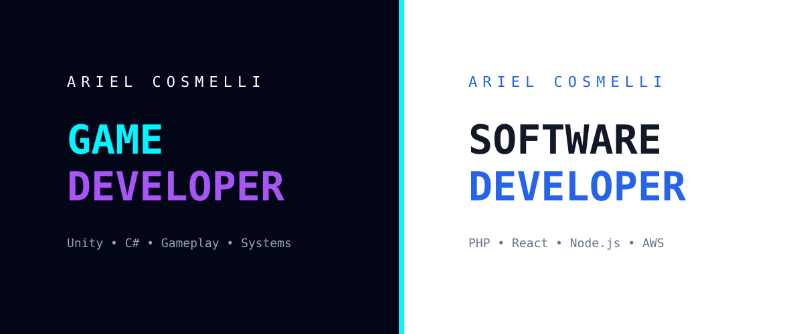

  

<h1 align="center">Hola 👋, Soy Ariel</h1>

  💻 Desarrollador Web & Game Developer en formación  
  🎮 Apasionado por la tecnología, el diseño y los videojuegos

---

## 🌐 Contacto

  

---

## 🚀 Sobre mí

Me gusta construir experiencias que no solo funcionen, sino que se sientan bien al usarlas.  
Combino desarrollo web con una mirada creativa orientada al diseño y la experiencia del usuario.

* 🔭 Actualmente trabajando con **PHP (Backend & Frontend)**
* 🎓 Estudiante de **Licenciatura en Desarrollo de Videojuegos**
* 🌱 Explorando **IA, nuevas tecnologías y herramientas modernas**
* ⚡ Interesado en **Game Design, UX y sistemas interactivos**

---

## 💻 Stack Tecnológico

<table align="center" width="100%">
  <tr>
    <td align="center" width="25%"><strong>🎨 Frontend</strong></td>
    <td align="center" width="25%"><strong>⚙️ Backend</strong></td>
    <td align="center" width="25%"><strong>🗄️ Database & Cloud</strong></td>
    <td align="center" width="25%"><strong>🛠️ Tools & Others</strong></td>
  </tr>

  <tr>
    <td align="center" width="25%">
       
       
       
       
      
    </td>
    <td align="center" width="25%">
       
       
       
      
    </td>
    <td align="center" width="25%">
       
       
       
       
      
    </td>
    <td align="center" width="25%">
       
       
       
       
      
    </td>
  </tr>
</table>

---

## 🐍 Actividad

  

